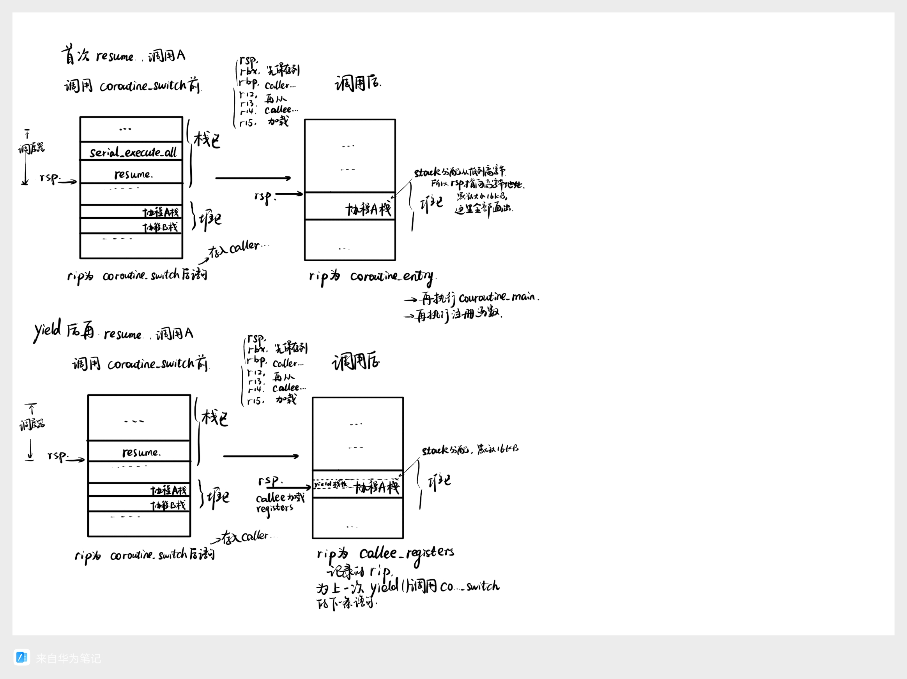
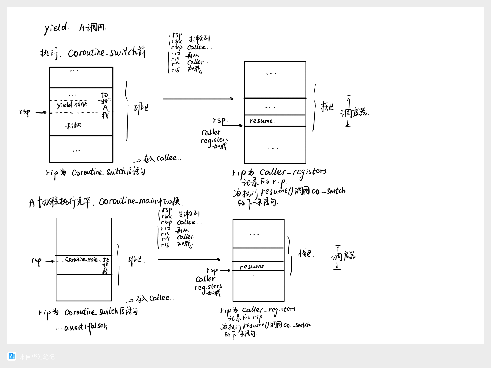
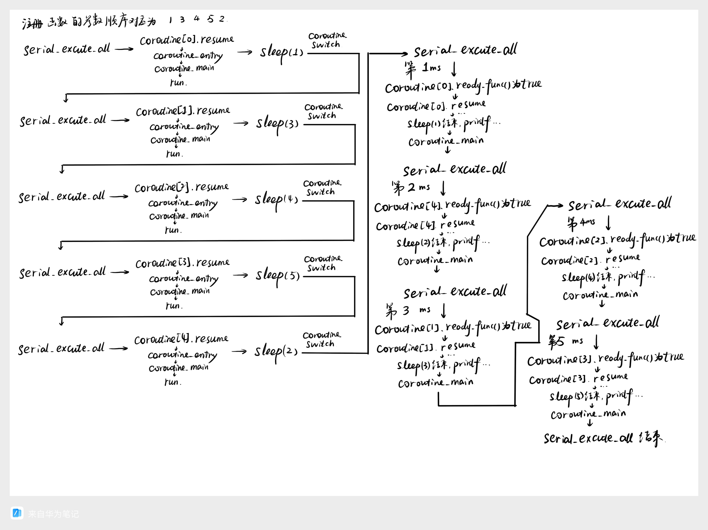
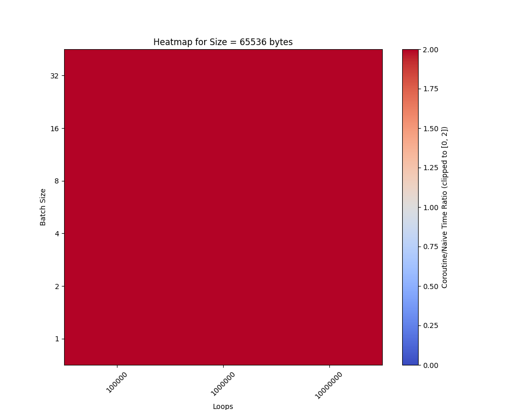
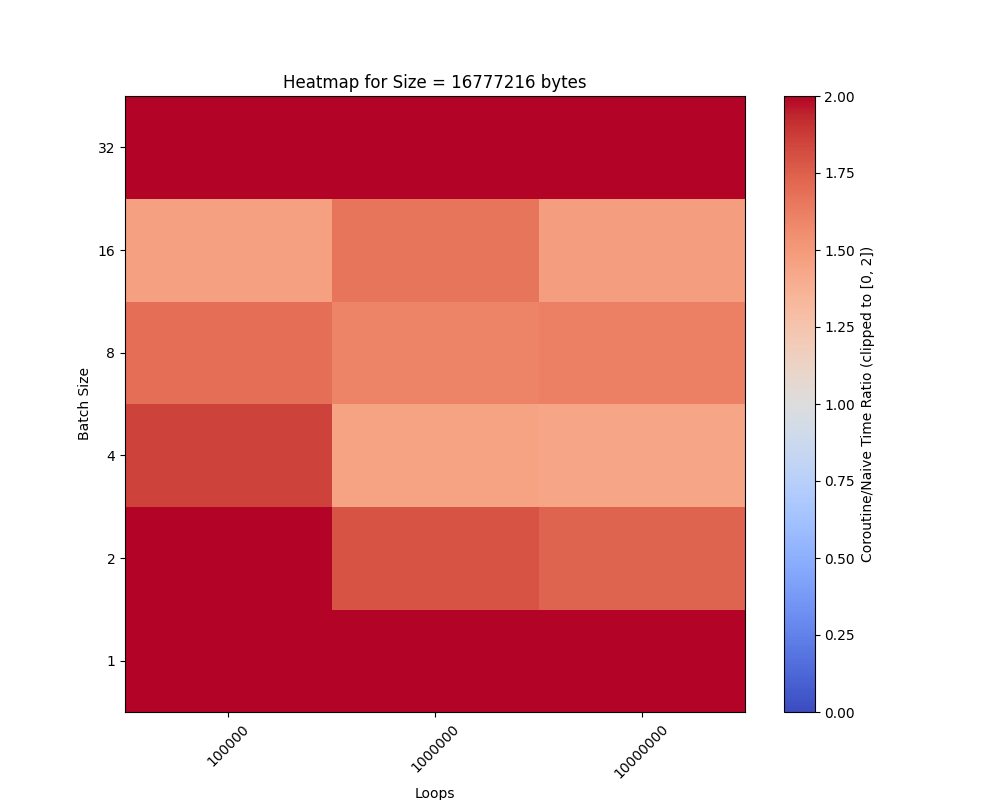
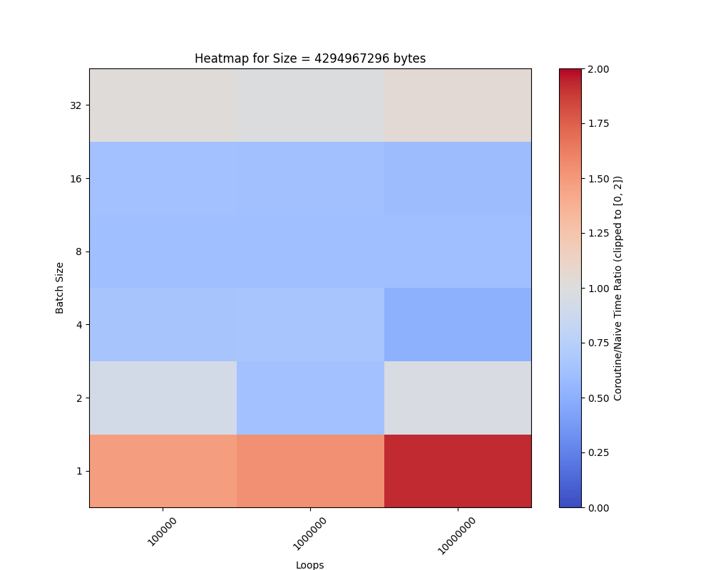

# ICS Coroutine Lab Report
##### Zeng Guanyang

### Task 1: 协程库编写
在`context.h`中定义`basic_context`结构体存放了协程函数模拟的栈帧、正在运行时寄存器值（`callee_saved`）和调用前寄存器值（`caller_saved`），以及标记协程执行情况参数等信息。此外还包括了虚函数`run`和`resume`，为执行和恢复协程提供接口。  

`context.S`的实现
```s
.global coroutine_switch
coroutine_switch:
    # TODO: Task 1
    # 保存 callee-saved 寄存器到 %rdi 指向的上下文
    # rsp开始为第8个
    movq %rsp, 64(%rdi)
    movq %rbx, 72(%rdi)
    movq %rbp, 80(%rdi)
    movq %r12, 88(%rdi)
    movq %r13, 96(%rdi)
    movq %r14, 104(%rdi)
    movq %r15, 112(%rdi)
    # 保存的上下文中 rip 指向 ret 指令的地址（.coroutine_ret）
    leaq .coroutine_ret(%rip), %rax
    movq %rax, 120(%rdi)


    # 从 %rsi 指向的上下文恢复 callee-saved 寄存器
    movq 64(%rsi), %rsp
    movq 72(%rsi), %rbx
    movq 80(%rsi), %rbp
    movq 88(%rsi), %r12
    movq 96(%rsi), %r13
    movq 104(%rsi), %r14
    movq 112(%rsi), %r15
    # 最后 jmpq 到上下文保存的 rip
    jmpq *120(%rsi)
```

`serial_execute_all`函数（Task 1版）的实现
```cpp
bool finished = false;
while(!finished) {//有协程未结束
  finished = true;//先假设所有协程都结束了
  for (int i = 0; i < coroutines.size(); i++) {//轮询
    if (!coroutines[i]->finished) {//对未结束的协程进行resume
      context_id = i;//设置当前协程id
      coroutines[i]->resume();
      finished = false;//标记有协程未结束
    }
  }
}
```
`yield`函数的实现
```cpp
void yield() {
  if (!g_pool->is_parallel) {
    // 从 g_pool 中获取当前协程状态
    auto context = g_pool->coroutines[g_pool->context_id];

    // 调用 coroutine_switch 切换到 coroutine_pool 上下文
    coroutine_switch(context->callee_registers, context->caller_registers);
  }
}
```

`resume`函数的实现
```cpp
virtual void resume() {
  // 调用 coroutine_switch
  // 在汇编中保存 callee-saved 寄存器，设置协程函数栈帧，然后将 rip 恢复到协程 yield 之后所需要执行的指令地址。
  coroutine_switch(caller_registers, callee_registers);
}
```

##### 协程切换的栈变化

关于`resume`  


关于`yield`以及执行结束


##### 执行过程
```cpp
template <typename F, typename... Args>
void new_coroutine(F f, Args... args) {
  coroutines.push_back(new coroutine_context(f, args...));
}
```
注册协程时，创建新的`coroutine_context`实例，将函数地址和参数传入，将`coroutine_context`实例加入`coroutines`中，便于之后的调用。  
```cpp
basic_context(uint64_t stack_size)
    : finished(false), ready(true), stack_size(stack_size) {
  stack = new uint64_t[stack_size];
  // 对齐到 16 字节边界
  uint64_t rsp = (uint64_t)&stack[stack_size - 1];
  rsp = rsp - (rsp & 0xF);
  // 声明，使得能够获得函数地址
  void coroutine_main(struct basic_context * context);
  callee_registers[(int)Registers::RSP] = rsp;
  // 协程入口是 coroutine_entry
  callee_registers[(int)Registers::RIP] = (uint64_t)coroutine_entry;
  // 设置 r12 寄存器为 coroutine_main 的地址
  callee_registers[(int)Registers::R12] = (uint64_t)coroutine_main;
  // 设置 r13 寄存器，用于 coroutine_main 的参数
  callee_registers[(int)Registers::R13] = (uint64_t)this;
}
```
在创建`coroutine_context`实例先调用父类`basic_context`的构造函数。此时为协程分配了一定大小的栈空间，并且十六字节对齐。同时初始化了RIP为`coroutine_entry`函数的地址，R12为协程主函数的地址，R13为`coroutine_context`实例的地址，便于协程的执行。对于`coroutine_context`的构造函数，则是保存了注册的函数地址和参数，设定栈大小默认为16KB，确保参数个数不超过7个。  

协程池通过`serial_execute_all`函数执行协程，通过轮询的方式，对于未结束的协程进行`resume`。  
```cpp
virtual void resume() {
  coroutine_switch(caller_registers, callee_registers);
}
```
首次调用`resume`时，调用`coroutine_switch`函数前，当前栈帧是`resume`，此时调用的协程栈空，但是在`callee_registers`中初始化了RIP为`coroutine_entry`函数的地址。在执行`coroutine_switch`函数后，保存了Caller Registers，将Callee Registers中的寄存器值读出并放入相应寄存器。此时通过`%rip`跳转到`coroutine_entry`函数开始执行协程。  
```s
.global coroutine_entry
coroutine_entry:
    movq %r13, %rdi
    callq *%r12
```
`coroutine_entry`将之前保存在`%r13`中的`coroutine_context`实例的地址赋给`%rdi`，并且调用协程主函数。  

```cpp
void coroutine_main(struct basic_context *context) {
  context->run();
  context->finished = true;
  coroutine_switch(context->callee_registers, context->caller_registers);

  // unreachable
  assert(false);
}
```
在协程主函数中，通过调用`basic_context::run`函数（虚函数，在`coroutine_context`中实现CALL），实现了注册函数的执行。当协程结束后，标记`finished`为`true`，此时的协程的栈帧为`coroutine_main`，协程调用者的栈帧为`resume`。此时进行类似`yield`的操作，通过`coroutine_switch`实现了协程的结束，回到调用者。若操作正常，`assert(false)`不会执行。

对未结束的协程，若不是首次调用`resume`，此时的栈帧为`resume`，但调用的协程栈帧非空，保留了`yield`及之前的栈帧。通过`coroutine_switch`函数，保存了Callerr Registers，将Callee Registers中的寄存器值读出并放入相应寄存器，实现上下文切换。此时通过`%rip`跳转到`yield`中调用`coroutine_switch`函数的下一条指令，即`coroutine_switch`函数中的`jmpq *120(%rsi)`，恢复了之前的协程执行。
```cpp
void yield() {
  if (!g_pool->is_parallel) {
    // 从 g_pool 中获取当前协程状态
    auto context = g_pool->coroutines[g_pool->context_id];

    // 调用 coroutine_switch 切换到 coroutine_pool 上下文
    coroutine_switch(context->callee_registers, context->caller_registers);
  }
}
```
当协程`yield`后，此时协程当前栈帧为`yield`，协程调用者的栈帧保留在`resume`。`coroutine_switch`函数中保存了Callee Registers，将Caller Registers中的寄存器值读出并放入相应寄存器。此时通过`%rip`跳转到`resume`中调用`coroutine_switch`函数的下一条指令，将控制权交给调用者。

##### 浮点和向量寄存器
可以增加Registers枚举类型，此时`basic_context`中的`callee_registers`和`caller_registers`数组的大小增加。  
此外，在`coroutine_switch`函数中，需要添加汇编代码以保存和恢复浮点和向量寄存器到指定的寄存器存储空间。  

### Task 2: 实现sleep函数
此时需要对`serial_execute_all`函数进行修改，判断协程是否`ready`，并执行相关操作。
```cpp
bool finished = false;
while(!finished) {//有协程未结束
  finished = true;//先假设所有协程都结束了
  for (int i = 0; i < coroutines.size(); i++) {//轮询
    if (!coroutines[i]->finished) {//对未结束的协程进行resume
      if(!coroutines[i]->ready)//Task 2 sleep带来的ready属性
      {
        coroutines[i]->ready = coroutines[i]->ready_func();
      }
      if(coroutines[i]->ready)
      {//Task 1 & 2
        context_id = i;//设置当前协程id
        coroutines[i]->resume();
      }
      finished = false; // 标记有协程未结束
    }
  }
}
```
`sleep`函数的实现，非并行部分
```cpp
// 从 g_pool 中获取当前协程状态
auto context = g_pool->coroutines[g_pool->context_id];
// 获取当前时间，更新 ready_func
auto cur = get_time();

context->ready = false;
// ready_func：检查当前时间，如果已经超时，则返回 true
context->ready_func = [ms,cur]() {
  return std::chrono::duration_cast<std::chrono::milliseconds>(
             get_time() - cur)
             .count() >= ms;
};
// 调用 coroutine_switch 切换到 coroutine_pool 上下文
// 相当于 yield
coroutine_switch(context->callee_registers, context->caller_registers);
```

##### sleep_sort中不同协程运行情况
按照README.md提供的测例输入，运行情况为（可以认为左半部分瞬时完成）：


##### 更加高效的方法
在`ready_func`是通过查询当前时间和开始时间的差值是否大于等于`ms`来判断是否超时。事实上，sleep的时间间接反映了协程的优先执行顺序。因此我们可以利用优先队列来存储协程，根据`ms`的大小来调整优先级，从而实现每次执行优先队列的队列头即可。执行完成后，将协程从队列中弹出，直到队列为空。通过堆来实现可以将查询的时间复杂度降到$O(1)$，尽管维护堆的时间复杂度为$O(\log n)$，但也远远小于$O(n)$。    

### Task 3: 利用协程优化二分查找

二分查找代码
```cpp
void lookup_coroutine(const uint32_t *table, size_t size, uint32_t value,
                      uint32_t *result) {
  size_t low = 0;
  while ((size / 2) > 0) {
    size_t half = size / 2;
    size_t probe = low + half;

    // TODO: Task 3
    // 使用 __builtin_prefetch 预取容易产生缓存缺失的内存
    __builtin_prefetch(&table[probe],0);
    // 并调用 yield
    yield();

    uint32_t v = table[probe];
    if (v <= value) {
      low = probe;
    }
    size -= half;
  }
  *result = low;
}
```
__builtin_prefetch原型为`void __builtin_prefetch (const void *ADDR, rw, locality)`，其中`rw`为0表示读取，1表示写入，`locality`表示预取的局部性，0：数据几乎不会再次使用，预取到 L1 缓存后很快会被逐出；1：数据在短期内可能会再次使用；2：数据可能会多次使用；3：数据会非常频繁地使用（默认值，尽量保留在缓存中）。

##### 提升效果
可变参数为`Size`，`Loop`，以及`Batch Size`。
那么，在`log2_bytes`为16，24，32，`m`为10000，100000，1000000，`b`为1，2，4，8，16，32，64下，分别进行测试（`TESTER.cpp`），并绘制图表`PLOTER.py`。
可以看到
当`Size`较小时，协程并没有起到优化的作用，因为协程的切换开销大于二分查找的开销。但是当`Size`较大时，且`Batch Size`也合理的时候，协程的优化效果明显。`Batch Size`的增大会减少协程切换的次数，从而减少开销，但是过大的`Batch Size`会导致协程的优化效果减弱。




### 查阅资料

[简单解释 Coroutine](https://zhuanlan.zhihu.com/p/25979906)  
CS:APP

### 总结和感想

协程对提升程序效率有很大的帮助，尤其是在IO密集型的程序中。通过协程的优化，可以减少线程的切换，从而提高程序的效率。通过协程优化二分查找时，通过设置合理的参数，良好地发挥了协程的优势。  
此外还对于理解C++20引入的`co_await`、`co_yield`、`co_return`有关协程的关键词有所帮助。